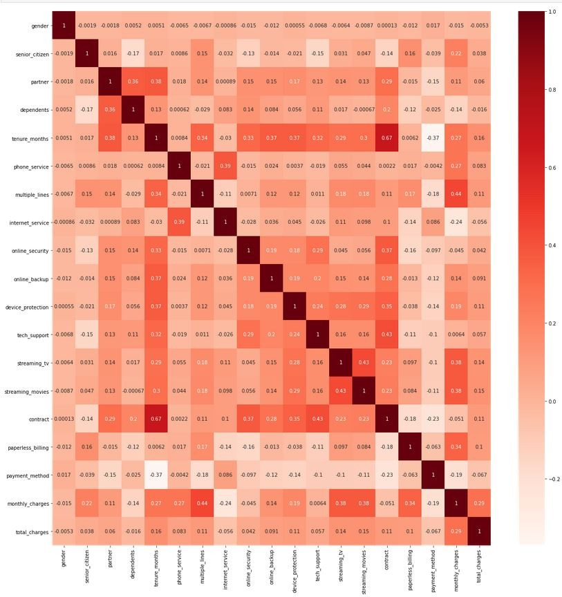
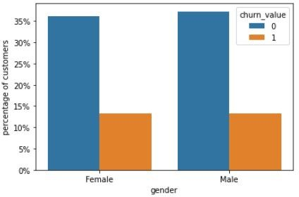
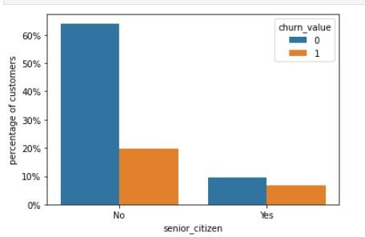

# Predicting Customer Turnover

# Introduction

In the modern world, there is a lot of competition between businesses to offer
the best deals to persuade customers to do business with them. These plentiful
options make it harder for companies to retain customers since another company
may offer different deals or services to entice customers to join them, this has
made preventing customer churn a necessity for businesses since they need to be
able to analyze when a customer is at risk to leave and to know why they’re
leaving to stop them from becoming part of the churn. Analyzing customer churn
allows companies to mitigate possible losses by being able to do risk-analysis
on your customer and improving relationships with them before they get to the
point of leaving. By doing an analysis on why customers are leaving, the company
can recognize parts of their service that need improving to keep customers
happy.

In the telecommunications business, there can be roughly 2.2% customer churn
monthly, which roughly results in over 25% of customers churning within a year
[[2](#_bookmark0)]. These churners can cost telecommunication businesses between
\$300 - \$600 to acquire new customers [[12](#_bookmark11)]. Churn analysis can
provide great benefits to companies by saving costs since losing customers can
be expensive. A lot of the cost that is incurred because of churn can be related
to customer acquisition costs since for each customer that is lost there needs
to be someone that can replace them. To create new customers, a company must be
willing to invest in customer acquisition which can result in costly marketing
campaigns. With the many options available now, it is not uncommon for customers
to frequently swap their services to another provider to receive better services
or prices [[12](#_bookmark11)]. This costly acquisition fee and knowing that
customers frequently churn can create an incentive for businesses to produce
methods that reduce churn since the cost of retaining customers is less costly
than acquiring new customers [[12](#_bookmark11)].

As we can see there is great benefit for companies that wish to hold onto
customers since reducing churn can increase a company’s profits. Although churn
analysis can be useful for dealing with customers it can also churn provide
useful analytics outside of just customer churn. Churn analysis methods could be
applied to other areas where churn can occur such as with employees or students.
Churn analysis can help find patterns in customers, students, and employees to
create groupings. These groupings can allow companies to find out when a
customer is at risk to leave [[3](#_bookmark2)]. This is useful to companies
since they can develop strategies aimed at various groupings and decide the

most optimal to minimize customer churning [[3](#_bookmark2)]. To do meaningful
customer churn analysis for our telecommunication data, it is important to have
relevant data, such as demographics, customer call lengths, billing information,
types of subscribed services etc. [[6](#_bookmark5)]. In this paper, I am going
to investigate using various features provided by a customer data set that
provides information about customer data related to telecommunications, ranging
from services, charges, tenure, and various demographic info about the customer
to predict when a customer is at risk to churn and to find the underlying
patterns between customers that lead to churning.

This paper will be organized in the following way, Section 2 contains the
literature review which expands on sub-topics of customer churn, such as why
churn prevention is important, types of churners and which methodologies are
being used to predict customer churn. Section 3 contains the methodology,
explaining the dataset, feature engineering/modeling building process and model
evaluation. Section 4 contains results and discussion. Section 5 contains the
conclusion.

# Literature Review

Churn reduction has become an important factor for companies as markets are
becoming increasingly competitive. Over 90% of C-level executives are saying
customer churn is their number one concern, but only 43% have gone as far as
investing in reducing churn [[4](#_bookmark3)]. The intense competition puts
pressure on companies to develop strong marketing campaigns and to better
understand customer needs [[5](#_bookmark4)]. To understand customer needs, many
companies have looked towards data mining which has become a common standard in
the industry to obtain customer insight since data mining can help find
underlying patterns for understanding customers. These underlying patterns can
be further used by finding similarities between groups of customers and allow
companies to create marketing campaigns directed at specific groups of customers
and make decisions for retaining customers based on their grouping
[[5](#_bookmark4)]. This raises the question of how can companies get involved
to reduce customer churn and reap the benefits of retaining high value customers
while also finding the underlying patterns causing customers to churn.

Before looking into methods for churn prediction, we must first understand where
churners are coming from, and which churners should be targeted for customer
retention. The churners are divided into two different groups, the voluntary and
non-voluntary [[10](#_bookmark9)]. The non-voluntary churner is someone who is
having their service cancelled by the company, either due to abuse of company
policies, a company may have stopped providing services in the area the user’s
area or the company could have failed thus not having services left to offer
[[7](#_bookmark6)]. Non-voluntary churners are easier to identify than voluntary
churners since usually the company is revoking services from the non-voluntary
churners [[7](#_bookmark6)]. Voluntary churners on the other hand are revoking
their services by their choice. Voluntary churners are likely to leave for
common reasons such as bad experiences with customer service, finding better
offers with competitors, or simply due to a company offering poor service
[[9](#_bookmark8)]. It becomes clear that the value for companies is going to
come from attempting to retain customers that are starting to fall into the
voluntary churners category as they are leaving on their own volition rather than having
their services ended by the company.

Many authors have different ideas of what is best when it comes to evaluating
churn prediction but what is generally agreed upon is that machine learning will
play a large role. The customer churn prediction problem seems to still be an
impasse for what is considered to be the optimal model to use, however it seems
that most researchers are using multiple algorithms such as logistic regression,
decision trees, naive bayes, or artificial neural networks, with some authors
suggesting the best practice is to use hybrid-models which can make usage of
multiple algorithms to achieve better generalized results [[8](#_bookmark7)],
[[1](#_bookmark1)]. Mahajan et al, conducted a review of models by various
authors and concluded that the best methods to achieve accurate results would
come from hybrid methods that made usage of multiple machine learning algorithms
rather than singular algorithms [[11](#_bookmark10)]. Outside of choosing a
method, there is also a need for companies to be continually reviewing their
customer data and updating their models so they can keep up with dynamic
behaviour of customers [[12](#_bookmark11)]. No current method is going to be
able to provide a one size fits all solution for companies since customer
behaviour is also going to vary between geographic location and from company to
company. This leads into our question of how can companies make use of
methodologies to find potential churners before they become part of the churn?

# Methodology

## DataSet

The customer data used for this paper, provides 33 features for 7000 customers
that can be used for our predictive model. For the most part, the data seems to
be fairly clean, outside of the “churn reason” feature which has 5174 empty or
null values. The data set itself was provided initially provided by IBM Cognos
Analytics and was uploaded to Kaggle. The data set provides some features that
will most likely be used such as:

-   Tenure with the company
-   Total charges
-   Contract type

However, the choice of which features will be used will be left up to a feature
selection model.

## Feature Engineering

To start with feature engineering first I had dropped all the very correlated
data associated with churn value, features such as churn label, churn score,
cltv (a customer value score), and churn reason which provided reasons as to why
a customer churned were all dropped to avoid a bias and to minimize the number
of features in our dataset. Other data that was removed included geographic data
such as Country, State, City, zip code and latitude/longitude, since all data
was from the California, USA. After

dropping these features, ordinal encoding was applied to convert all nominal
data to numeric data.

For this project I have decided to use 2 different methods to try and find the
optimal features and the optimal number of features to use. The first method was
using a simple filter method by checking feature correlation with other
features. After the correlation is used, we can look to see if there are any
highly correlated features that can be removed to saved processing time when
running data through the model but in Figure 1 we can see there is not much
correlated data outside of tenure and contract, thus not leaving room for
feature reduction.

The second method used was a wrapper method where step forward and step backward
feature selection were both used. Step forward feature selection was suggesting
sim- ilar accuracy as step backward feature selection but was proposing 16
features to be used rather than 10. Both step forward and step backward models
were trained using Random Forest Classifier.

Figure 1: Feature Correlation Map

## Model Building

To build the first model we will take all the available 18 features and pass
them into a Random Forest Classifier model to get a baseline of how accurate the
model can be using all of the features. In the case of using the 18 features the
model can

<table>
<tr>
<td>Figure 2: Feature Importance With All Features</td>
<td></td>
</tr>
<tr>
<td>Figure 3: Feature Importance After Dropping Features</td>
<td></td>
</tr>
</table>

achieve 79.8% accuracy. We can see in Figure 2 that there are relatively few
features that suggested to provide a lot of importance to the model, these
features included: tenure months, monthly charges, total charges.

By dropping the other features and only keeping the 3 highly contributing
features, the second model was able to achieve 75% accuracy, although the model
is losing nearly 5% of the accuracy.

Using the suggested 10 features from step backward feature selection the model
can achieve 77.8% accuracy. Reducing the overall number of features from 18 but
still having a little over 3 times as many features as the previous model.

## Model Evaluation

As we can observe from the results, the model with all the features is producing
the best results. The downside to this model is that we are having to use all
the features which in this case is not a problem since the number of features is
relatively small and does not require a lot of processing time.

However, the model with 3 features can achieve similar levels of accuracy as the
model with all 18 features despite having a 1 of the features. Although the
model does take a hit in accuracy, as it loses nearly 5% of the accuracy that
the model with 18 features has, the reduction in features is significant.

In the model that used the features from step backward feature selection, the
results are middling. The number of features is reduced to 10 from 18 and
achieves slightly worse accuracy compared to the 18 features model but slightly
better accuracy than the 3 features model.

# Results & Discussion

Predicting churn and finding informative characteristics of customer churn is
achievable. The models using Random Forest Classifier were all able to achieve
relatively good results with varying amounts of features. The filter method used
in this paper was not able to help reduce the overall number of features but
using the feature importance attribute provided by Random Forest Classifier we
were able to find

<table>
<tr>
<td>Figure 4: Churn by Gender</td>
<td></td>
</tr>
<tr>
<td> Figure 5: Senior Citizen Churn vs Non-Senior Citizen Churn</td>
<td></td>
</tr>
</table>

which features would be highly valued in the model, allowing us to reduce the
overall number of features. Step backward and step forward feature selection
were also able to provide valuable insight that there was room to reduce the
features while maintaining higher levels of accuracy.

We can also observe that the data set shows that there is no discernible
difference between churners by gender, both men and women seem to churn at
nearly the same rate. The interesting piece in this data, is that it is
suggested that even though senior’s makeup a small part of the overall data,
they happen to be contributing at nearly double the rate that non-senior
citizens churn. Possibilities for this phenomenon could be related to declining
health of senior citizens, or no longer being able to afford payments. There
does seem to be a research gap in understanding the reason for this unusually
high churn rate among senior citizens.

# Conclusion

With the amount of competition between companies, it is important for businesses
to tap every potential source of revenue. Churn prediction is important for
modern companies, and not just in financial sectors. Churn prediction can be
applied to other sectors, such as reducing churn with students or looking into
employee retention. Understanding why people are leaving is ultimately the goal
shared between all sectors involved with reducing churn. Pinpointing why
customers are leaving will allow companies to reduce churn and predict potential
churners to further increase retention and save costs that would otherwise go to
expensive customer acquisition campaigns. Modern machine learning has made
predicting potential churners and finding the causes much easier than it would
have been in the past, companies can identify the customers that require extra
attention and apply various strategies based on that customers habits to try and
retain them. Although hiring data scientists may be expensive, the benefits of
having an understanding of your customer base is invaluable.

# References

1.  Javad Basiri, Fattaneh Taghiyareh, and Behzad Moshiri. A hybrid approach to
    predict churn. In *A Hybrid Approach to Predict Churn*, pages 485 – 491, 01
    2011.

2.  Alex Berson, Stephen Smith, and Kurt Thearling. *Building Data Mining
    Applica- tions for CRM*. McGraw-Hill Professional, 1st edition, 1999.

3.  Patrick Campbell. Customer churn analysis: One of saas’s most important pro-
    cesses. <https://www.profitwell.com/customer-churn/analysis>. Accessed:
    2021-10-21.

4.  Soumi De, Prabu P, and Joy Paulose. Effective ml techniques to predict
    customer churn. *2021 Third International Conference on Inventive Research
    in Computing Applications (ICIRCA), Inventive Research in Computing
    Applications (ICIRCA), 2021 Third International Conference on*, pages 895 –
    902, 2021.

5.  Liu Duen-Ren and Shih Ya-Yueh. Integrating ahp and data mining for product
    recommendation based on customer lifetime value. *Information & Management*,
    42(3):387 – 400, 2005.

6.  Navid Forhad, Md Hussain, and Mohammad Rahman. Churn analysis: Predicting
    churners. In *Churn analysis: Predicting churners*, pages 237–241, 09 2014.

7.  John Hadden, Ashutosh Tiwari, Rajkumar Roy, and Dymitr Ruta. Computer
    assisted customer churn management: State-of-the-art and future trends.
    *Computers & Operations Research*, 34(10):2902–2917, 2007.

8.  Bingquan Huang, Mohand Tahar Kechadi, and Brian Buckley. Customer churn
    prediction in telecommunications. *Expert Systems with Applications*,
    39(1):1414– 1425, 2012.

9.  Hee-Su Kim and Choong-Han Yoon. Determinants of subscriber churn and
    customer loyalty in the korean mobile telephony market. *Telecommunications
    Policy*, 28:751–765, 10 2004.

10. Clement Kirui, L. Hong, Weldon Cheruiyot, and H. Kirui. Predicting customer
    churn in mobile telephony industry using probabilistic classifiers in data
    mining. *IJCSI Int. J. Comput. Sci. Issues*, 10:165–172, 01 2013.

11. Vishal Mahajan, Richa Misra, and Renuka Mahajan. Review on factors affecting
    customer churn in telecom sector. *International Journal of Data Analysis
    Tech- niques and Strategies*, 9(2):122–144, 2017.

12. Chih-Ping Wei and I-Tang Chiu. Turning telecommunications call details to
    churn prediction: a data mining approach. *Expert Systems with
    Applications*, 23(2):103– 112, 2002.
